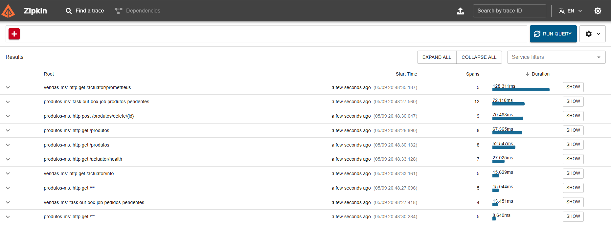

# Java Advanced — CP4 e CP5

Repositório com os microserviços **vendas-ms** e **produtos-ms**, desenvolvidos ao longo das aulas de Java Advanced (FIAP).

---

## Microserviços

| Serviço | Porta | Descrição |
|---|---|---|
| `vendas-ms` | 8080 | Gestão de clientes e pedidos |
| `produtos-ms` | 8082 | Catálogo de produtos |

---

## Tecnologias

- Java 21 + Spring Boot 3
- Spring Security (OAuth2 via GitHub)
- Spring Data JPA + Flyway + MySQL
- Thymeleaf
- ActiveMQ (mensageria JMS)
- Micrometer + Zipkin (observabilidade)
- Docker Compose

---

## Como executar

### Pré-requisitos

- Java 21
- Docker e Docker Compose
- Dois [GitHub OAuth Apps](https://github.com/settings/developers) configurados:
    - `vendas-ms`: callback `http://localhost:8080/login/oauth2/code/github`
    - `produtos-ms`: callback `http://localhost:8082/login/oauth2/code/github`

### 1. Subir a infraestrutura

```bash
cd vendas-ms
docker compose up -d
```

Isso sobe MySQL (com `vendasdb` e `produtosdb`), ActiveMQ, Zipkin, Prometheus, Loki, Grafana e Spring Boot Admin.

### 2. Executar os serviços

**Terminal 1 — vendas-ms:**
```bash
cd vendas-ms

export OUATH_VENDAS_MS_CLIENT_ID_GIT=<client_id>
export OUATH_VENDAS_MS_SECRET_ID_GIT=<client_secret>

./mvnw spring-boot:run
```

**Terminal 2 — produtos-ms:**
```bash
cd produtos-ms

export OUATH_PRODUTOS_MS_CLIENT_ID_GIT=<client_id>
export OUATH_PRODUTOS_MS_SECRET_ID_GIT=<client_secret>

./mvnw spring-boot:run
```

### 3. Dar permissão ao usuário

Após o primeiro login, execute no banco `vendasdb`:

```sql
INSERT INTO usuario (login) VALUES ('seu-login-github') ON DUPLICATE KEY UPDATE login = login;
INSERT INTO usuarios_roles (login, role) VALUES ('seu-login-github', 'ROLE_PEDIDO');
INSERT INTO usuarios_roles (login, role) VALUES ('seu-login-github', 'ROLE_CLIENTE_EDIT');
```

Para o `produtos-ms`, a role `ROLE_PRODUTO` é inserida automaticamente via migration (`V3`), bastando editar o arquivo com seu login antes de rodar pela primeira vez.

---

## Fluxo de mensageria

Ao salvar um produto no `produtos-ms`, o seguinte fluxo é executado:

1. O produto é persistido e um `OutboxEvent` é criado na **mesma transação**
2. O `OutBoxJob` publica o evento na fila `produto.queue` a cada 10 segundos, injetando os headers de trace B3 na mensagem JMS
3. O `ProdutoConsumer` no `vendas-ms` consome a mensagem, restaura o contexto de rastreamento e registra o recebimento em log

O trace completo — desde o HTTP POST até o consumo da mensagem — é visível no Zipkin sob o mesmo `traceId`.

---

## Evidência de rastreabilidade

O diretório `evidencias/` contém o print do Zipkin com o trace distribuído conectando os dois serviços.



---

## Endpoints úteis

| Ferramenta | URL |
|---|---|
| vendas-ms | http://localhost:8080 |
| produtos-ms | http://localhost:8082 |
| Zipkin | http://localhost:9411 |
| ActiveMQ console | http://localhost:8161 |
| Prometheus | http://localhost:9090 |
| Grafana | http://localhost:3000 |
| Spring Boot Admin | http://localhost:8081 |
| Métrica customizada | http://localhost:8082/actuator/metrics/produtos.salvos |